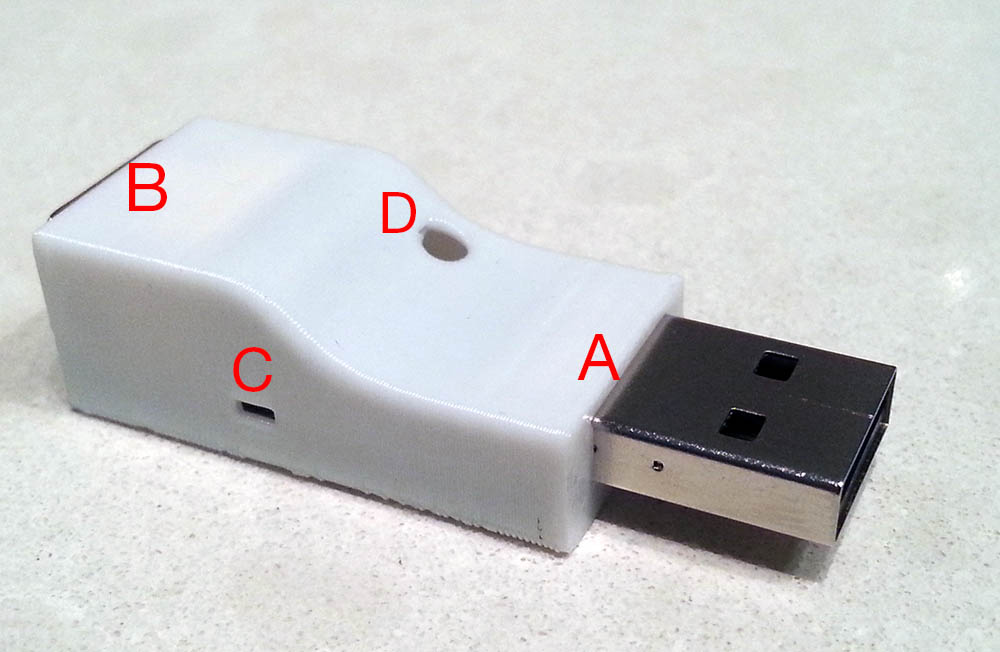

# Overview
There are several ports on the converters:

* A - USB port. Plug into computer
* B - Nunchuck port. Plug into Tatacon
* C - Light hole. A hole for blinking
* D - Reset hole. In case of firmware update failure, poking this with a 
toothpick or similar puts the board into failsafe (bootloader) mode.

# Configuration
Plug the converter in to your computer and open the [TaTaConfig](https://chrome.google.com/webstore/detail/tataconfig/ndeibflmpllogilncdmoajadcopjkchg).
Here are the available settings:

* Keys - The converter pretends to be a keyboard. Which keys should it hit?
* Enable LEDs - Enable or disable LEDs on each hit
* Switch debouncing. If 2 hits are made within the debounce time, the second
is ignored. Higher values give less false positives. Lower values let you bounce
your sticks for drum rolls.

# Programming
**At the time of writing, there are no firmware updates** for the converters.

However, if you would like to write or fork your own firmware, you are free to.
You can program via USB using the HIDBootloader sample application from the
LUFA distribution. If you want to modify the bootloader, you must use the ISP
breakouts. Plug the converter into a USB port for power, and connect the rest
of the pins to the labelled pads on the board.

I used pogo pins and a short USB extension lead when programming the boards,
and it made the process very fast.