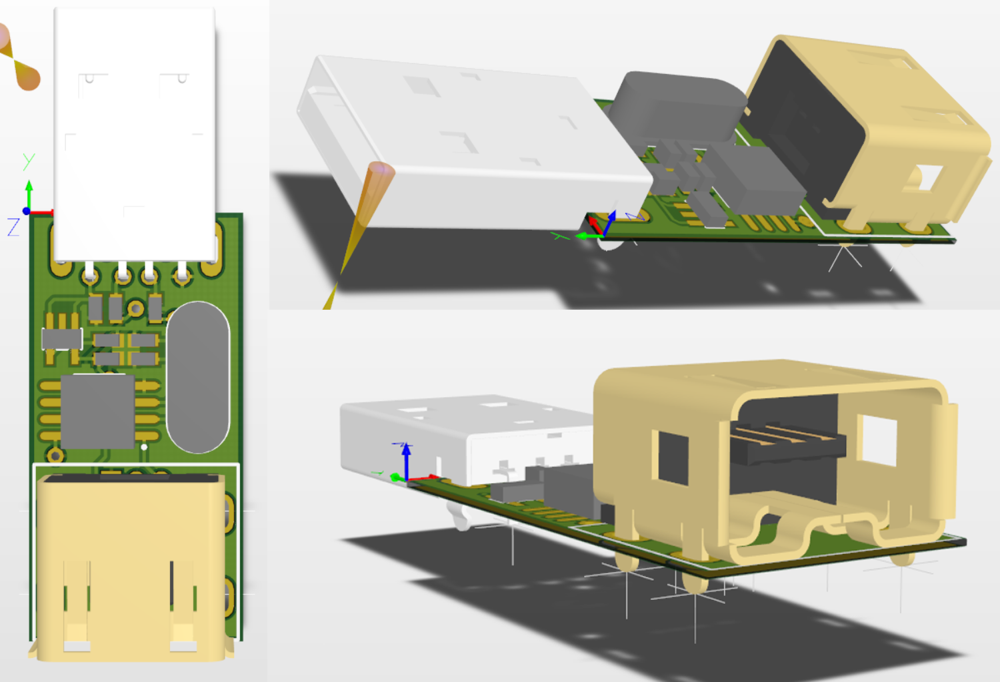

# TataconUSB
A small dongle to connect your Wii taiko controller to your Nintendo Switch or computer as a USB
device, instead of using Bluetooth.

[Purchase here](https://mon.im/tatacon/)  
[User guide](UserGuide.md)



## Features
- Uses an atmega16u2 and the LUFA USB stack
- 1ms response time.
- Sweet LEDs (can be turned off)
- Responds so fast you can bounce your sticks and get multi hits. Can be turned off with Debounce feature.
- Tested working on official, Hori and knockoff controllers
- Nintendo Switch, Windows, Linux, Mac compatible + [cross platform Chrome app for configuration](https://chrome.google.com/webstore/detail/tataconfig/ndeibflmpllogilncdmoajadcopjkchg)
- Config app allows future firmware updates to add more features
- No drivers required!

## Building firmware:
Open a console.
To build the PC firmware navigate to `firmware/Keyboard`.
To build the Nintendo Switch firmware navigate to `firmware/SwitchPro`.
Run `make`. You will need AVR GCC installed.

To install hit the reset button, then `make flash` to use the Python loader(Windows) or `make flashC` to use the C loader(unix). 

Python loader requires pywinusb (https://pypi.python.org/pypi/pywinusb/) and
IntelHex (https://pypi.python.org/pypi/IntelHex/) libraries. 

C loader requires compiling with libusb-dev (Ubuntu) installed.

## Building software:
It's a Chrome web app. Install it like a normal dev app.

## Building hardware:
Send v5 Gerbers to a PCB fab and have fun with QFN soldering. If you want
a little less fiddling, use the seeed_bom.csv file along with the Gerbers
and use Seedstudio's Fusion PCBA service. Use a board thickness of 8mm.
As Seeed doesn't have them, you will need to add a USB A Male connector
(any through hole model should fit) and a Raphnet Nunchuck connector.

Altium Designer was used, open TataconUSB.PrjPcb as the main file.

Program the HID bootloader and clock fuses via `make init` and an SPI programmer.
The makefile is by default setup to use the USBAsp. I recommend pogo pins
in a breadboard + USB connection for power.
From there, program by hitting the hardware reset button, then `make flash`.


## Linux use
In order to use with the chrome configuration app, linux users must edit their udev rules.

### UDEV rules
Write in  /etc/udev/rules.d/50-tatacon.rules:
```
#Original firmware for PC/OSU
ATTRS{manufacturer}=="mon.im", MODE:="0664", GROUP:="plugdev"

#Switch/WiiU Hori Pokken Pad
SUBSYSTEM=="usb", ATTR{idVendor}=="0f0d", ATTR{idProduct}=="0092", MODE="0664", GROUP="plugdev"
KERNEL=="hidraw*", ATTRS{idVendor}=="0f0d", ATTRS{idProduct}=="0092",  MODE="0664", GROUP="plugdev"
```